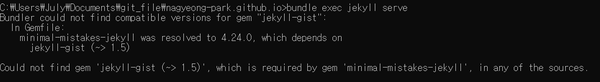

# 블로그 설치 과정

1. 테마를 다운

2. 내 레포에 테마 넣기

3. 확인 > 잘 뜸 !

4. config__.yml 수정

5. 테마 깨짐

6. jeykill 다운로드 : 32비트로 다시

7. >gem install jekyll
   >
   >gem install bunder
   >
   >bundle exec jekyll serve
   >
   >에러!

8. 구글링 : bundle update
9. bundle install
10. gem install bundler
11. bundle exec jekyll serve => 정상 작동!